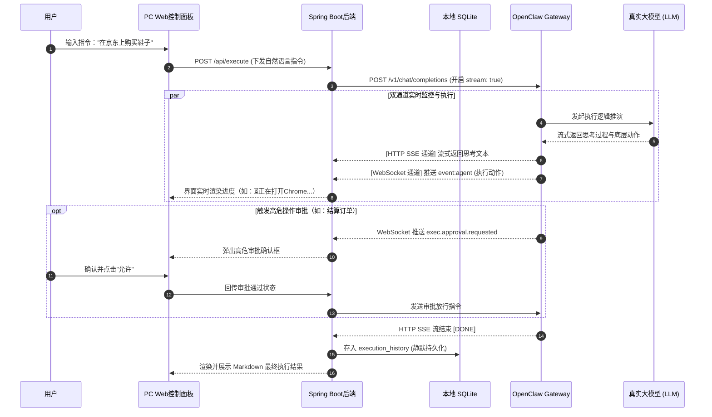
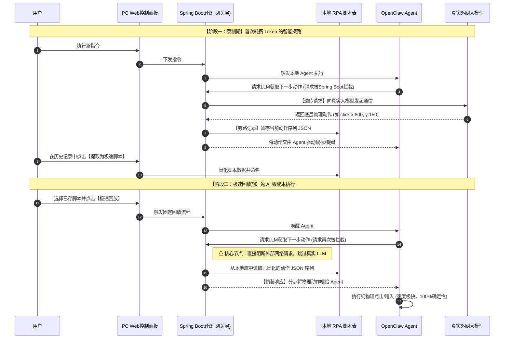

# 速控侠（Claw Chat）PC端开发方案

## 一、方案概述

本PC端为OpenClaw便捷使用工具的核心本地执行端，支持Windows 10/11、Ubuntu 20.04及以上版本跨平台运行，采用后台服务与浏览器网页界面分离架构。

**核心数据与通信架构边界：**

1. **云端联动（账号与鉴权）**：用户管理（注册、登录、找回密码、绑定邮箱等）及跨端组网穿透均由「速控侠官方云服务器」提供支持。PC端通过 HTTP RESTful API 与云端交互获取鉴权 Token。
2. **本地执行（私有与安全）**：全程基于OpenClaw官方原生开放的HTTP/WebSocket Gateway接口实现全链路对接，所有业务逻辑均通过官方标准接口交互，完成「自然语言指令执行→执行过程实时推送→指令历史记录管理→历史指令一键复用」的完整业务闭环。
3. **数据隔离**：用户的指令历史、快捷指令、执行日志及录制的自动化脚本等**私有数据全部存储于本地PC**，绝不上云，保障绝对的隐私与安全。

## 二、核心技术栈与工程结构规范

### 2.1 核心技术选型

1. **后端开发**：JDK 21 LTS + Spring Boot 3.5.x
2. **前端界面**：Ant Design Pro V5
3. **本地数据库**：SQLite3 嵌入式单文件数据库
4. **Web容器**：Undertow
5. **对接方式**：内部对接 OpenClaw 官方 HTTP REST API + WebSocket Gateway；外部对接速控侠云端服务器 RESTful API。
6. **通信协议**：HTTP RESTful、WebSocket
7. **系统服务**：Windows Service、Ubuntu Systemd
8. **日志组件**：SLF4J + Logback
9. **安装部署**：Windows一键EXE安装包、Ubuntu一键Shell脚本。采用单目录绿色便携架构，内置 JDK 21 JRE。
10. **统一开发工具 (IDE)**：为了保障代码规范与团队协作效率，全端开发工具指定如下：
* **后端开发 (Java/Spring Boot)**：统一使用 **IntelliJ IDEA**。
* **前端开发 (PC控制面板/Web页面)**：统一使用 **WebStorm**。
* **配套移动端开发 (Android)**：统一使用 **Android Studio**。


### 2.2 项目代码包结构设计 (Package Structure)

建议 PC 端的 Spring Boot 项目按以下领域驱动结构划分，指导后端开发落地：

```text
com.clawchat.pc
 ├── config        // 本地配置：SQLite 数据源, WebSocket 客户端配置, 跨域配置
 ├── core          // 核心控制层
 │    ├── gateway  // OpenClaw Gateway 生命周期管理 (ProcessBuilder 启停, 保活心跳)
 │    └── proxy    // Mock LLM 代理引擎 (核心！拦截真实 LLM 请求，伪装返回 RPA 序列)
 ├── web           // 本地前端 API 接口 (提供给 Ant Design Pro 控制面板调用的接口)
 ├── websocket     // WebSocket 监听器 (监听 OpenClaw 的 agent 事件与审批事件)
 ├── service       // 本地业务逻辑：指令解析、历史记录存储、RPA 脚本格式化
 ├── mapper        // SQLite 数据库操作层 (MyBatis-Plus)
 ├── entity        // SQLite 数据库实体类 (PO)
 └── utils         // 工具类：Markdown 解析器, 系统托盘(SystemTray) 控制

```

## 三、核心业务场景推演 (User Scenarios)

为了让开发人员更清晰地理解底层业务逻辑，以下推演用户在 PC 端控制面板的真实使用场景：

### 🎬 场景一：沉浸式指令监控与高危熔断

* **用户行为**：用户在 PC 控制面板输入：“清理一下我电脑 C 盘的临时文件”。
* **前端展示**：界面实时流式输出 Agent 的思考状态，如：`⏳ 正在打开文件资源管理器...` -> `⏳ 正在定位 Temp 文件夹...`。
* **高危拦截**：当 Agent 准备执行“删除文件”时，OpenClaw 底层触发 `exec.approval.requested`。PC 端的 WebSocket 监听到此事件，立即在前端弹出一个醒目的模态框：“Agent 请求删除文件，是否允许？”。用户点击“允许”后，系统回传确认信令，动作继续执行。

### 🎬 场景二：AI动作录制与零成本极速回放（Mock LLM 劫持）

* **录制期**：用户输入“在京东上购买一双耐克鞋”。Spring Boot 后台将该请求透传给大模型。在执行过程中，Spring Boot 的 `proxy` 包悄悄把 LLM 返回的每一组底层物理动作（如坐标点击、键盘输入）拦截并暂存。执行成功后，用户在历史记录里点击**【提取为极速脚本】**，系统将其存入 SQLite 的 `rpa_scripts` 表。
* **回放期**：次日，用户在【自动化脚本】菜单点击该脚本的**【极速回放】**。此时，Spring Boot 切断了与外网大模型的请求，直接从 SQLite 读出录制好的 JSON 动作序列，伪装成大模型的样子分步喂给 OpenClaw Agent。鼠标瞬间精准点击，全程零 Token 消耗、100% 确定性。

## 四、官方标准API对接层设计

### 4.1 OpenClaw架构说明与生命周期管理

OpenClaw的核心是一个**Gateway进程**，作为统一的控制平面，通过WebSocket协议对外提供服务，并兼容OpenAI标准的HTTP REST接口（`/v1/chat/completions`）用于指令下发。

* **服务启停**：PC端启动时，通过 `ProcessBuilder` 检测并执行启动命令 `openclaw gateway --port 18789`。关闭时发送停止信号并销毁句柄。
* **保活机制**：PC端每5秒通过WebSocket `health` 检测状态，异常时最多重试3次自动重启Gateway。

> **⚠️ 重要：HTTP Chat Completions接口默认关闭**
> 必须在 `~/.openclaw/openclaw.json` 中显式配置 `chatCompletions: { enabled: true }`。PC端安装时须自动通过脚本合并此配置。

### 4.2 官方核心对接接口明细

* **指令执行接口**：`POST http://127.0.0.1:18789/v1/chat/completions`。支持传入 `stream: true` 启用SSE流式输出。
* **控制平面接口**：`ws://127.0.0.1:18789`。PC端需完成 `connect.challenge` 握手并持久化 `deviceToken`。核心监听事件包括 `agent` (执行过程) 和 `exec.approval.requested` (待审批通知)。

### 4.3 核心交互流程推演（以“在京东上购买鞋子”为例）

1. **指令下发**：Spring Boot 组装指令并发往本地 Gateway 的 REST 接口，开启流式输出。
2. **双通道监控**：Gateway 通过 HTTP SSE 流返回 Agent 的思考过程；同时通过 WebSocket 推送 `event:agent` 动作事件（如展示“正在打开Chrome浏览器”）。
3. **拦截审批**：Agent 准备执行敏感点击时，Gateway 推送 `exec.approval.requested` 事件。控制面板弹出审批框，用户允许后继续。
4. **结果存证**：收到 `[DONE]` 结束标志后，展示 Markdown 结果，并将指令原文、状态静默存入本地 SQLite。

**▼ 场景交互底层时序图：**



## 五、核心功能模块设计

### 5.1 云端账号与鉴权模块

PC端需通过速控侠云端服务器认证后方可使用高级组网功能。

* **注册与登录**：支持邮箱注册、账号密码登录。
* **找回密码**：未登录状态下，通过绑定的邮箱接收验证码直接重置新密码（无需旧密码）。
* **修改密码**：已登录状态下，在个人中心操作，**必须校验旧密码**后才可设置新密码。
* **鉴权持久化**：云端下发的 `JWT Token` 和邮箱加密持久化至本地 SQLite 的 `sys_config` 表。

### 5.2 AI动作录制与极速回放模块（AI-to-RPA 创新引擎）

采用**代理网关层劫持方案（Mock LLM 方案）**，实现大模型探路一次成功后，零成本极速物理回放。

* **代理层拦截 (录制期)**：PC 端的 Spring Boot 服务充当 LLM 代理网关。当首次执行指令时，网关将 LLM 返回的结构化工具调用（Tool Calls，如鼠标坐标、键盘输入）按顺序暂存，用户可选择将其存为 RPA 脚本。
* **伪装网关 (回放期)**：用户触发极速回放时，PC 端网关**直接阻断对真实大模型的网络请求**，从本地数据库读取录制好的 JSON 序列，伪装成大模型分步返回给 OpenClaw Agent 继续执行，实现 100% 确定性和零 Token 消耗。

**▼ 代理网关录制与劫持时序图：**



### 5.3 本地Web控制面板模块 (Ant Design Pro 规范)

控制面板通过浏览器本地访问（默认 `http://127.0.0.1:9527`）。未登录拦截跳转至全屏登录页。UI 布局对标企业级数据中后台，主菜单采用左侧折叠树形结构：

* 🚀 **1. 工作台 (Workspace)**
* **仪表盘 (Dashboard)**：Gateway与云端连接状态、今日/累计执行次数图表。
* **指令执行 (Execute)**：自然语言指令输入，流式逐字显示回复，支持 Markdown 及动作事件流展示。


* 📁 **2. 指令管理 (Command Management)**
* **历史记录 (History)**：以数据表格形式展示本地历史执行记录。支持一键智能复用，新增【提取为极速脚本 (Save as RPA)】操作项。
* **快捷指令 (Shortcuts)**：常规文本指令列表、关键词触发。
* **自动化脚本 (Automations)**：可视化展示截获的动作序列，支持微调坐标/等待时间，提供零成本极速回放入口。


* ⚙️ **3. 系统与账号 (System & Account)**
* **👤 个人中心 (User Center)**：展示账号邮箱；提供修改密码、绑定邮箱功能。
* **🛠️ 系统设置 (Settings)**：Gateway连接配置、历史保留天数、日志查看；新增**大模型代理网关配置**（将 OpenClaw 底层 LLM URL 指向 PC 端服务）。


### 5.4 系统服务与日志处理模块

* 支持Windows系统服务(WinSW)、Ubuntu Systemd后台运行，提供系统托盘快捷入口。
* Logback实现日志按日分割、滚动清理（默认保留30天）。

## 六、本地数据库设计 (SQLite)

采用SQLite3嵌入式单文件数据库，存储于 `~/.openclaw-tool/data.db`，使用 **Flyway** 管理跨版本Schema自动升级。

### 核心数据表结构

1. **sys_config（系统配置表）**
* 新增字段：`cloud_auth_token`, `login_user_email`（仅存Token，绝不存明文密码）。
* 原有字段：`local_panel_port` / `gateway_port` / `auto_start` 等。


2. **execution_history（指令执行历史表）**
   *(核心字段：id, command_text, result_text, status, session_id, duration_ms, created_at, is_favorited)*
   **注：此表数据绝对不上传云端，完全由本地 PC 掌控。**
3. **shortcut_command（快捷指令表）**
   *(核心字段：id, name, command_text, trigger_keyword, use_count, created_at)*
4. **rpa_scripts（自动化脚本表 - 新增）**
   *(核心字段：id, name, script_json_payload, created_at)*。存储用于免 AI 极速回放的动作序列数据。
5. **gateway_event_log（Gateway事件日志表 - 核心排障表）**
   *(核心字段：id, event_type, log_content, created_at)*。专门记录 restart / health_fail 等底层进程级事件，便于排障。

## 七、安全性与稳定性保障

1. **数据隔离**：明确区分“云端账号数据”与“本地隐私数据”。指令历史与自动化脚本绝不主动上报云端。
2. **网络隔离**：控制面板前端页面仅监听本地回环地址（`127.0.0.1`），不对外网暴露，防止局域网越权远控攻击。
3. **进程守护**：Gateway进程异常崩溃后，PC 端独立心跳线程将自动触发重启重建流程，最多连续重试3次。

## 八、安装与部署

1. **前置条件**：用户安装Node.js ≥ 22，完成 `openclaw onboard` 初始化配置。
2. **Windows**：一键EXE安装包，自动注册系统服务，安装后弹出登录界面完成鉴权。
3. **Ubuntu**：执行一键Shell脚本（`install.sh`），生成并启用 `systemd` 服务单元。