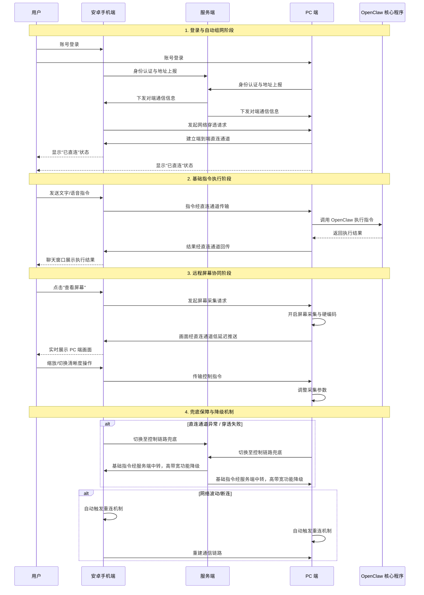

# 速控侠（Claw Chat）产品总方案

## 一、产品介绍

速控侠（Claw Chat）是一款专门面向 OpenClaw 用户的轻量化远程操控工具，由安卓手机端、PC 端、服务端三部分组成，旨在解决 OpenClaw 对接聊天工具时配置复杂、普通用户难以入手的困境，全面覆盖基础指令操控、高级自动化模板、远程屏幕协同等多样化场景需求。

用户仅需在安卓设备安装对应 APK，在 PC 设备（一期支持 Windows 10、Windows 11 以及 Linux 系统）安装相应程序，并登录同一账号，系统便会自动完成组网对接与权限适配，真正实现开箱即用。**（注：考虑到系统底层权限限制与合规要求，iOS 与 macOS 端暂不纳入一期支持，将视后续市场反馈与研发规划推进）**。服务端部署于云服务器，负责地址转发、连接调度、数据中转以及账号权限管控，全方位保障三端全链路稳定互通。

本产品广泛适配市面上绝大多数主流安卓手机和平板，严格遵循系统开发规范与隐私合规要求，让用户使用更加安心。

## 二、产品整体架构

采用先进的三端协同架构，各端职责明确且紧密联动，具体如下：

1. **安卓手机端**：作为用户的核心操作入口，是实现远程操控、指令下发、状态查看、消息交互的主要平台。所有功能围绕用户体验做极简交互设计，界面简洁易懂、操作方便快捷，如同使用日常聊天软件一般轻松上手。
2. **服务端**：部署于云服务器，承担地址协商、连接协助、数据兜底转发、连接生命周期管理、跨设备数据同步、账号权限管控以及计费统计等核心任务。通过为双端提供标准化对接接口，确保全链路的稳定性与高效性。
3. **PC 端**：作为用户本地部署的执行端，负责与 OpenClaw 核心程序对接，完成指令执行、屏幕采集、状态上报、模板管理等重要工作。与安卓端协议互通、数据同步，实现指令与画面的双向顺畅流转。指令执行采用多线程技术提升效率，同时针对 Windows 10、Windows 11、Linux 不同操作系统做优化，确保各系统下稳定运行。

### 三端交互流程图

## 三、核心功能

### 1. 基础核心功能

* **极简聊天式交互**：借鉴微信聊天窗口交互逻辑，用户发送文字或语音指令即可完成操控，大幅降低学习成本。例如输入 “打开 [文件名]”，系统即可快速响应，无专业知识也能使用。
* **Markdown 格式支持**：聊天窗口全面支持 Markdown 格式渲染，指令执行结果、状态通知、模板说明等内容均可通过 Markdown 格式展示，支持代码高亮、表格、列表、加粗/斜体等语法，让信息展示更清晰、结构更分明。
* **零配置自动组网**：安卓端与 PC 端登录同一账号后，系统自动完成网络穿透、对端对接、通道建立等操作，无需手动配置网络参数，零基础用户 1 分钟内可快速上手。
* **全链路状态可视化**：双端实时同步展示核心连接、功能运行等关键状态，通过不同颜色指示灯 / 图标显示服务端连接、PC 端在线等状态，异常问题直观可见，无需专业网络知识即可快速排查。
* **指令传输与执行闭环**：手机端发送的指令实时传输至 PC 端，PC 端对接 OpenClaw 执行后，结果自动回传至手机端展示，形成完整操作闭环，高效准确保障操作的及时性与有效性。
* **断连自动重连**：网络波动、切换网络或进程重启时，系统自动触发重连机制重建通信链路，全程无需人工干预，保障使用过程的连贯性。
* **合规账号体系**：构建统一账号管控体系，支持账号密码、短信验证码、生物识别等多种安全登录方式，实现精准身份识别、操作记录留存、账号安全防护，为计费、权限管理、跨设备数据同步提供底层支撑。

### 2. 高级核心功能

* **远程屏幕实时协同**：PC 端实时采集屏幕画面并低延迟推送至手机端，用户可在手机端实时查看，还支持清晰度切换、画面缩放、横竖屏自适应等操作，实现远程操作所见即所得，适用于远程协助等场景。
* **指令模板快捷复用**：支持将常用完整操作一键固化为可复用模板，用户可自定义快捷编号与参数，后续输入编号即可一键触发执行，无需重复输入长段指令。同时支持模板编辑、批量导入导出、跨设备同步，大幅提升操作效率，适用于自动化办公等场景。

## 四、核心通信机制

采用创新的双链路冗余通信架构，兼顾传输稳定性与低延迟，核心逻辑如下：

1. **地址协商与身份校验**：双端登录后，借助服务端完成地址协商与身份校验，获取对端通信信息并自动发起网络穿透，建立端到端直连通道（P2P），全程运用加密算法保障信息传输安全。
2. **双链路分工协作与降级策略**：
* **控制链路**经服务端兜底传输，负责账号认证、状态同步、基础指令传输、重连调度等，确保通信可靠性。
* **数据链路**优先经端到端直连通道传输，负责屏幕画面、大体积文件等高带宽数据，大幅降低延迟。
* **智能降级保护**：针对国内复杂网络环境下 P2P 穿透失败的情况，系统自动触发降级策略。此时基础控制指令无缝切换至服务端中转，保障核心操控 100% 必达；对于远程屏幕协同等高带宽功能，将限制其通过服务端中转的流量（如：免费版直接禁用或提供极低帧率体验，付费版可提供限速的高速中转），从而在保障核心体验的同时，严控云端高昂的带宽成本。

3. **适配移动端网络环境**：针对移动端复杂多变的网络环境，采用规范保活机制（如定期发送心跳包），有效避免进程被系统中断，确保连接始终稳定。

## 五、标准使用流程

### 1. 基础使用流程

1. **设备部署**：安卓设备安装对应 APK，PC 设备安装适配程序，安装流程与普通软件一致，简单便捷。
2. **统一登录**：安卓端与 PC 端登录同一账号，系统自动完成设备绑定与身份校验，保障操作安全。
3. **自动组网**：两端自动完成地址协商、网络穿透、直连通道建立等操作，无需手动干预，实现设备互联互通。
4. **状态确认**：双端同步展示连接状态，绿色标识代表连接成功，用户可正常使用。
5. **功能使用**：安卓端聊天窗口发送文字 / 语音指令，PC 端接收后调用 OpenClaw 执行，执行结果实时回传至安卓端。
6. **异常处理**：网络波动、进程重启等情况发生时，系统自动触发重连机制，重建通信链路，不影响用户使用。

### 2. 高级功能使用流程

1. **远程屏幕查看**：直连通道建立后，安卓端聊天页显示 “查看屏幕” 常驻入口，点击进入独立窗口即可实时查看 PC 端画面，支持清晰度切换、画面缩放、横竖屏自适应等操作。
2. **指令模板使用**：指令执行成功后，可一键将操作存为模板，自定义名称、快捷编号与参数；后续在聊天框输入编号发送，即可一键触发完整动作执行，结果实时返回。
3. **模板管理**：安卓端、PC 端均可完成模板的编辑、修改、导入导出、删除、云端同步等操作，确保双端模板数据实时一致，方便跨设备管理。

## 六、全链路状态展示

双端同步实时展示全链路核心状态，采用统一配色规范，异常状态一目了然：

1. **服务端连接状态**：正常为绿色 “已连接”，异常为红色 “已断开”，同步展示重连倒计时与异常原因。
2. **对端直连状态**：在线为绿色 “已直连” 并展示网络延迟，离线为灰色 “未连接”，建连中为黄色 “组网中”。若直连失败转为服务端中转，则显示为蓝色的“中转连通”。
3. **屏幕推送状态**：推送中为蓝色 “实时推送中”，关闭为灰色 “屏幕推送关闭”，同步展示当前清晰度与实时帧率。
4. **模板运行状态**：执行中为黄色 “模板执行中”，完成为绿色 “模板执行成功”，异常为红色 “模板执行失败”，同步展示执行进度与失败原因。

## 七、屏幕推送机制

针对移动端硬件特性做全链路性能优化，确保低延迟、低占用、高流畅度，核心逻辑如下：

1. **开启屏幕采集推送**：直连通道建立后，用户可选择自动 / 手动开启采集推送，画面数据优先通过专属直连通道传输，不经过服务端存储转发，全程端到端加密，保障隐私安全。
2. **采用硬编码硬解码方案**：利用硬件加速能力，大幅降低设备 CPU 占用，解码渲染延迟极低，中低端设备也能流畅运行。
3. **支持双模式切换与码率调整**：支持标清 / 高清双模式切换，系统根据网络带宽自动调整码率，避免卡顿；采用低资源占用采集方案，不影响 OpenClaw 核心程序运行与 PC 本地性能。

## 八、产品核心优势

1. **零配置开箱即用**：安装登录后系统自动完成组网对接，无需手动配置网络参数，对比同类竞品，零基础用户可快速上手，节省时间精力。
2. **极简操作无门槛**：采用聊天式交互 + 语音输入，解放双手，无需学习专业指令，会发消息即可使用，易用性更强，覆盖更广泛用户群体。
3. **高效复用提效率**：指令模板一键固化、快捷调用，避免重复操作，模板支持跨设备实时同步，对比部分竞品本地存储、同步不及时的问题，提升工作效率效果显著。
4. **智能网络自适应**：端到端直连传输无中转延迟，结合 P2P 穿透失败时的智能服务端中转降级机制，复杂网络环境下也能做到“核心控制永不掉线”，解决竞品网络不稳定时的卡顿、失联问题。
5. **状态可视化可控**：全链路状态双端同步展示，异常问题直观可见、排查便捷，无需专业知识，对比竞品状态展示不全、排查难度大的问题更具竞争力。
6. **安全合规可控**：OpenClaw 核心程序运行于用户自有 PC，核心指令、画面、数据优先 P2P 直连，采用系统级安全加密，符合隐私合规规范，用户数据完全自主可控。
7. **全场景协同覆盖**：实现手机端远程操作、PC 端本地执行、屏幕实时回显，一站式完成 OpenClaw 全场景操控，覆盖个人使用、远程协助、自动化执行、批量任务处理等需求。

## 九、结果反馈机制

采用全链路双向状态同步机制，确保执行结果与状态实时反馈，让用户操作全程可查、可控：

1. **指令执行状态回传**：指令执行全流程状态实时回传，结果、进度、失败原因以聊天消息形式展示，无需手动刷新。
2. **连接与功能状态同步**：连接状态、功能运行状态双端毫秒级同步，异常状态同步推送提醒，方便用户实时掌握全链路运行情况并及时响应。
3. **问题告警与解决方案**：出现穿透失败触发降级、指令执行异常、网络断开等问题时，系统实时推送告警通知，同步展示异常原因与解决方案，无需用户自行排查。

## 十、账号体系

构建完整的统一账号体系，实现全链路身份管控与数据安全保障：

1. **统一账号绑定**：安卓端与 PC 端需登录同一账号使用，基于账号唯一标识实现设备绑定、身份识别，支持单账号多设备管理，兼顾使用便捷性与账号安全性。
2. **多方式安全登录**：支持账号密码、短信验证码、生物识别等登录方式，适配全机型，满足不同用户的登录习惯与设备条件，提升登录便捷性与安全性。
3. **全链路安全管控**：实现操作记录留存、登录设备管理、异地登录告警、账号安全防护等功能，为计费管理、权限分配、高级功能跨设备同步提供底层支撑，全方位保障账号安全与数据隐私。

## 十一、版本与计费

1. **免费版**：可使用全部基础核心功能，搭配基础标清屏幕推送（直连状态下可用，若直连失败则限制屏幕推送功能）、最多 10 条指令模板存储与基础调用权限；展示非侵入式合规广告，设置每日使用时长 / 指令频率上限，无需付费即可体验基础功能，降低使用门槛。
2. **付费版**：开通付费会员即可解锁全部高级核心功能，享受无广告、无使用时长 / 频率限制的服务，支持跨网高清屏幕推送（享专属高速中转通道）、优先通信通道、无上限指令模板存储、模板批量导入导出、自定义参数模板等全量高级权限。
3. **分发渠道**：支持国内主流安卓应用商店上架、APK 直装包下载，覆盖全渠道分发场景，方便用户获取与安装。

## 十二、抖音系广告平台对接方案

### 12.1 对接平台选型

本次广告对接**首选字节跳动官方「穿山甲广告联盟」**，该平台是抖音系唯一官方广告变现平台，整合了抖音、抖音极速版、今日头条、西瓜视频等字节全系流量的广告资源，是国内头部移动广告联盟，核心选型优势如下：

* **资源优质**：覆盖品牌广告、效果广告全品类，广告填充率高、eCPM 收益稳定，适配工具类APP变现需求；
* **合规性强**：严格遵循《广告法》《个人信息保护法》等国家法规，提供完善的隐私合规适配方案，规避应用商店上架风险；
* **适配性广**：完美支持安卓5.0及以上全机型，兼容本产品的安卓APK安装包，提供标准化SDK，接入成本低；
* **结算稳定**：官方直签合作，结算周期透明，无账期风险，支持对公/个人多种结算方式，数据可追溯；
* **生态联动**：可与抖音系内容生态联动，后续可拓展抖音小程序、抖音账号引流等增值变现模式。

### 12.2 广告位场景设计

**核心原则：**速控侠作为一款效率与应急控制工具，用户极有可能在 PC 端程序暴走时急需打开 App 下发终止指令。因此，**坚决取消“开屏广告”等阻塞核心操作路径的变现方式**。所有广告位均避开核心操控动作，具体设计如下：

| 广告类型 | 展示场景 | 触发规则 | 展示位置 | 频次管控 |
| --- | --- | --- | --- | --- |
| 信息流Banner广告 | 聊天列表主页面 | 用户进入APP主界面常驻展示，不随聊天列表滚动 | 聊天列表页面底部，输入框下方，绝对不遮挡核心聊天内容、指令输入框与功能按钮 | 常驻展示，每30秒自动轮播刷新，无强制点击要求 |
| 激励视频广告 | 权益解锁场景 | 用户主动点击触发，非强制展示 | 独立全屏视频页面，播放完成后自动关闭 | 无频次上限，由用户主动触发，用于解锁免费版的指令频率上限、额外指令模板、临时高清屏幕推送等权益 |
| 插屏广告 | 非核心操作结束场景 | 用户在管理后台完成模板保存、设置修改等非紧急、非核心操作后，低频触发 | APP半屏弹窗，支持一键关闭 | 单日单用户展示不超过2次，核心操作路径（即时指令发送、屏幕查看）全程绝对不触发 |

### 12.3 技术对接实现方案

#### 12.3.1 对接前置准备

1. **账号注册**：在穿山甲广告联盟官网完成企业主体账号注册、资质认证，开通广告变现权限；
2. **应用创建**：在穿山甲平台创建本产品安卓应用，填写应用名称、包名、应用介绍、分发渠道等信息，完成应用备案；
3. **代码位创建**：按上述广告位设计，分别创建 Banner、激励视频、插屏3类代码位，获取对应的广告位ID、SDK接入密钥；
4. **合规配置**：在平台完成隐私政策配置，同步更新本产品用户协议、隐私政策，明确告知用户广告数据采集范围与用途，获取用户授权后再初始化广告SDK。

#### 12.3.2 安卓端SDK集成

1. **依赖配置**：在安卓项目Gradle文件中添加穿山甲SDK依赖，配置混淆规则，适配安卓13及以上版本的权限要求（仅申请必要的网络、设备信息权限，不强制申请非必要权限）；
2. **SDK初始化**：在APP启动页中，完成用户隐私政策授权后，异步初始化穿山甲SDK，传入接入密钥与用户唯一标识，绝不阻塞APP启动速度；
3. **广告位逻辑开发**：
* **Banner广告**：在聊天列表页底部嵌入Banner广告组件，设置页面生命周期绑定，页面销毁时自动释放广告资源；
* **激励视频广告**：预加载广告资源，用户点击解锁权益时拉起视频广告，监听播放完成回调，播放完成后为用户发放对应临时权益；
* **插屏广告**：按频次管控规则预加载，仅在指定的低优先级/后台管理场景触发展示，设置强制关闭按钮，不强制用户观看/点击；

4. **资源释放**：所有广告组件均绑定页面生命周期，页面退出、APP退到后台时自动销毁广告实例，避免内存泄漏与后台耗电。

#### 12.3.3 服务端对接与账号体系打通

1. **广告数据回调**：对接穿山甲广告服务端回调接口，获取用户广告展示、点击、播放完成、收益等明细数据，同步到本产品服务端；
2. **账号权限联动**：与产品账号体系深度打通，付费版用户登录后，服务端下发无广告标识，安卓端自动屏蔽所有广告请求、销毁广告实例，全程无任何广告展示；
3. **激励权益管理**：服务端记录用户激励视频广告完成情况，管理临时权益的生效时长、使用范围，确保权益发放准确、可追溯；
4. **数据统计**：服务端同步广告数据与用户行为数据，搭建用户变现数据看板，实现eCPM、填充率、点击率、人均收益等核心指标的实时监控。

### 12.4 合规管控体系

1. **隐私合规管控**：严格遵循穿山甲平台隐私规范与国家法律法规，仅在用户同意隐私政策、完成授权后初始化广告SDK，不超范围采集用户数据，不强制申请非必要权限，支持用户关闭广告个性化推荐；
2. **广告内容审核**：开启穿山甲平台「广告内容过滤」功能，屏蔽违规、低俗、虚假宣传、竞品相关广告，设置行业过滤规则，确保广告内容符合应用商店上架要求与产品定位；
3. **用户权益保障**：所有广告均设置明确的关闭/跳过按钮，不设置虚假关闭按钮、不强制用户点击/观看广告，不诱导用户下载应用，不中断核心功能使用；
4. **反作弊管控**：对接穿山甲反作弊接口，拦截刷量、虚假点击等作弊行为，确保广告数据真实有效，规避账号封禁风险。

### 12.5 收益结算模式

1. **结算规则**：采用穿山甲平台官方分成模式，广告收益按平台约定比例进行分成，无平台服务费、无隐藏扣费；
2. **结算周期**：按月结算，每月1-5日平台出具上月结算账单，核对无误后15个工作日内完成打款，支持对公账户结算，提供合规发票；
3. **数据对账**：平台提供明细化的广告数据报表，可按日、按广告位、按用户维度查询展示量、点击量、eCPM、预估收益等数据，支持账单明细核对；
4. **税费处理**：按国家相关法律法规执行，企业主体合作可提供增值税专用发票抵扣，合规处理税费相关事宜。

### 12.6 广告展示管控与优化

1. **展示频次管控**：严格执行广告位频次上限规则，避免过度打扰用户，导致用户流失；
2. **分群运营**：基于用户活跃度、使用频次、设备机型等维度，实现广告位精细化运营，对高价值用户降低广告展示频次，对低频用户优化广告填充率；
3. **数据优化**：持续监控核心变现指标，优化广告位展示场景、触发规则，提升eCPM与用户留存的平衡；
4. **版本适配**：持续跟进穿山甲SDK版本更新，及时适配安卓系统新版本、应用商店最新合规要求，确保广告功能稳定运行。

### 12.7 付费版去广告机制

1. **权限校验**：付费版用户的去广告权限基于服务端统一校验，本地无法篡改，用户登录后实时同步权限状态；
2. **广告屏蔽**：付费用户登录后，安卓端全程不初始化广告SDK、不发起任何广告请求、不加载任何广告资源，确保纯净无广告的使用体验；
3. **权益保障**：用户付费完成后，立即生效去广告权益，无需重启APP，自动销毁已加载的广告实例，清除所有广告展示；
4. **权限续期**：付费权益到期后，自动恢复免费版广告展示规则，提前3天向用户推送权益到期提醒。

## 十三、后续定制化功能

基于产品高扩展性架构，结合市场需求与行业趋势，为不同用户提供全场景定制化服务，满足个性化需求：

1. **品牌与界面定制**：支持品牌 LOGO 替换、界面布局定制、专属交互逻辑开发、一键换肤等，满足企业客户的品牌定制需求，助力企业提升品牌影响力。
2. **自定义技能对接**：支持定制化 OpenClaw AI Skills 对接，适配专属业务场景的指令解析、执行逻辑、结果反馈，为不同行业与企业提供贴合实际业务的解决方案。
3. **专属部署服务**：提供专属云服务器中转链路部署、私有化服务端部署等方案，满足企业对数据安全和低延迟的严格要求，优化网络部署并提升服务质量。
4. **高级功能定制**：支持屏幕采集参数自定义、多设备同时连接操控、指令模板批量定制与团队共享、状态日志导出与异常告警、自动化任务定时执行等个性化功能，进一步提升产品适用性与用户满意度。
