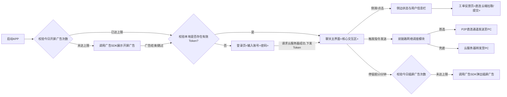

# 速控侠（Claw Chat）手机端开发方案

## 一、方案概述

速控侠手机端是面向 OpenClaw 用户打造的轻量化工具类 APP。产品延续聊天式极简交互的设计理念，帮助用户解决移动端操作难的痛点。在架构定位上，手机端的跨端聊天功能专门用于与 PC 端进行直接交互（控制 OpenClaw），而其余所有功能（如登录、工单、用户信息、广告策略等）均直接与部署在云服务器上的服务端进行交互。同时，依托服务端的地址协商能力，手机端与 PC 端之间实现了内网穿透与直连通信。

## 二、场景描述

* **云端交互场景（手机 ↔ 云服务器）**：用户打开 APP 观看开机广告后，向云服务器发起账号密码登录请求。登录后，向云服务器拉取用户身份类型（普通/包月）及到期时间进行展示。日常使用中，用户向云端提交图文工单，并在每次进入页面时实时拉取查看运维回复；使用超 10 分钟后，由本地触发并结合云端/联盟策略展示插屏广告。
* **设备操控场景（手机 ↔ PC端）**：在核心的聊天主界面中，用户输入指令并发送。底层网络优先尝试打通手机与目标 PC 的内网穿透通道；穿透成功后，指令直接以类似微信聊天的方式发送给 PC 端，实时接收 PC 端 OpenClaw 返回的 Markdown 格式执行结果。当前会话的聊天记录仅在内存中展示，退出即焚，不作本地固化。

## 三、功能列表

* **登录功能**：支持账号 + 密码登录，无需注册（注册功能暂未规划）。
* **登录信息保存**：支持登录信息保存，开启自动登录后直接进入聊天主界面。
* **跨端聊天功能**：可与 PC 端进行实时聊天，PC 端对接 OpenClaw。
* **连接状态查看功能**：实时展示两类连接状态：与 PC 端的连接状态、与云服务器部署的服务端的连接状态。
* **工单提交与反馈功能**：支持提交 APP 自身问题的反馈工单。
* **工单提交形式**：支持图片 + 文字描述。
* **图片处理**：由手机端程序自动完成图片压缩。
* **工单回复查看**：可查看运维人员对已提交工单的回复。
* **广告功能-开机广告**：用户点击 APP 时弹出，按秒倒计时，广告结束后进入登录界面，每日仅展示 1 次。
* **广告功能-聊天主页广告**：在聊天主界面使用 10 分钟后弹出，带秒级倒计时可观看，每日仅展示 1 次。
* **用户信息展示功能**：展示当前用户身份类型：普通用户 / 包月用户。
* **包月用户特权展示**：包月用户额外展示会员到期时间。

## 四、功能设计

本章节侧重于各核心模块的功能定位、业务满足条件以及底层的通信流转设计，指导后续的具体代码开发。

### 4.1 整体页面流转逻辑



### 4.2 启动与广告分发模块

本模块主要负责应用冷启动的平滑过渡，以及与第三方广告联盟 SDK（如穿山甲）的策略对接。

* **广告分类管控**：
* **开屏广告（Splash）**：应用冷启动时触发。APP 端仅负责校验本地 `DataStore` 中的当日展示次数（每日限 1 次）；若符合条件，则初始化并调用广告 SDK 返回的开屏 View。**倒计时与跳过逻辑均由广告 SDK 内部原生接管**。
* **聊天页插屏广告（Interstitial）**：用户在聊天主页连续停留满 10 分钟后触发。同样校验每日 1 次的展示上限，达标后调用 SDK 的插屏广告接口弹出展示。


* **业务流转诉求**：广告展示完毕或用户主动跳过后，模块需立刻读取本地缓存的登录凭证。若有 Token 且处于有效期，则静默放行至聊天主页；否则阻断并跳转至登录页。

### 4.3 登录与认证模块

在服务端接口规范明确前，本模块主要确保满足以下业务与交互诉求：

* **核心诉求**：提供基础的账号与密码输入交互（密码需支持明暗文切换），并提供「自动登录」的勾选选项。
* **网络与数据诉求**：
* 触发登录后，将账号密码加密后提交给云服务器进行校验。
* 接收并解析服务端返回的业务数据：必须包含**用户凭证（Token）**、**用户身份标识（普通用户/包月用户）**，若是包月用户还需解析出**会员到期时间**。
* 将上述敏感信息通过 AES 等加密手段安全固化到本地缓存中，供其他模块全局调用。无注册入口，若服务端返回账号不存在则直接阻断并提示。


### 4.4 跨端聊天与网络通信模块（核心）

本模块不关注前端界面的气泡渲染细节，重点聚焦于手机端如何将指令稳定、低延迟地送达目标 PC 端，并接收执行结果。

* **双链路架构设计**：
* **信令协商（云端 WebSocket）**：进入聊天主页后，手机端第一时间与云端服务器建立 WebSocket 长连接。通过该连接，手机端向云端表明自身身份，并获取目标 PC 端的公网/内网 IP 及端口信息（前提是 PC 端也在线并连接了同一账号）。
* **P2P 直连打洞（首选链路）**：拿到 PC 端地址后，手机端底层网络模块尝试发起 UDP/TCP 打洞（NAT 穿透），云端通常需提供 STUN/TURN 服务辅助。一旦穿透成功，手机与 PC 建立点对点直连。此时用户发送的操控指令、以及 PC 端回传的 Markdown 结果数据，**全部走此直连通道**，实现极低延迟且不消耗云端服务器带宽。
* **云端转发（兜底链路）**：若所处网络环境复杂（如对称型 NAT）导致 P2P 打洞失败，网络模块需具备**无缝降级**能力。将指令重新封装，通过现有的 WebSocket 连接发送给云端服务器，由云服务器作为中继代理，转发给 PC 端。


* **UI 响应诉求**：接收到 PC 端返回的文本流后，支持标准的 Markdown 语法解析（尤其是代码块、表格），并以气泡形式追加至当前内存列表。退出页面即清空会话内存。

### 4.5 侧栏状态与用户信息模块

主要用于直观展示应用当前的底层运行状态与用户权益。

* **功能诉求**：
* **状态双显**：必须明确区分并展示两套网络状态。一套是**「与云服务器的连接状态」**（标识信令通道是否正常）；另一套是**「与 PC 端的直连状态」**（标识当前走的是 P2P 直连还是云端中转）。
* **权益感知**：根据登录模块获取到的数据，动态渲染用户身份。包月用户需醒目展示具体的到期日期，增强商业化转化引导。


### 4.6 工单反馈模块

提供轻量化的移动端运维问题上报途径。

* **功能诉求**：
* 支持纯文本或「文本+单张/多张图片」的表单提交形式。
* **强制本地异步压缩**：为节省用户流量和服务器带宽，APP 必须在调用系统相册获取图片后，在本地（非 UI 线程）执行图片尺寸缩放和质量压缩算法，达标（如控制在几百 KB 内）后再上传至云服务器。
* **实时交互**：不设计本地工单数据库。每次进入页面或下拉刷新时，直接调用云端 HTTP 接口拉取历史提交记录及运维人员的最新回复进行展示。


## 五、工程结构与技术规范

### 5.1 基础架构与规范

* **开发语言**：Kotlin 2.3.10，原生支持协程与 Flow，提高开发效率与代码稳定性。
* **架构模式**：采用 MVVM 分层架构（Model - View - ViewModel），实现 UI、业务逻辑、数据层的解耦。
* **核心 UI 框架**：Jetpack Compose，全页面采用声明式 UI 实现，遵循 Material3 设计规范。

### 5.2 核心依赖库版本

```toml
[versions]
agp = "8.13.2"
kotlin = "2.3.10"
coreKtx = "1.17.0"
lifecycleRuntimeKtx = "2.10.0"
activityCompose = "1.12.4"
navigationCompose = "2.9.7"
composeBom = "2026.02.00"
material3 = "1.4.0"

```

## 六、接口与通信协议规范

* **与云服务器通信协议（RESTful + WebSocket）**：
* **HTTP/HTTPS**：采用 Retrofit2 + OkHttp3 实现登录认证、用户信息获取、工单提交（Multipart 表单）与历史工单实时拉取等短连接请求。
* **WebSocket**：与云端保持控制链路长连接，用于接收地址协商数据，以及在内网穿透失败时的指令兜底转发。


* **与 PC 端通信协议（P2P 直连）**：
* **内网穿透通道**：依托云端信令服务完成 NAT 打洞后，手机与 PC 建立点对点（P2P）连接。跨端聊天指令和 Markdown 结果数据优先走此数据链路，极大降低延迟。


## 七、数据库设计

由于取消了业务数据的本地持久化，本方案**不引入 Room 或 SQLite 数据库**，全面采用轻量级键值对存储。

* **状态键值存储 (DataStore/SharedPreferences)**：基于 Kotlin 的轻量级存储机制，**仅缓存**以下三类核心状态数据：
1. **登录信息**：用户鉴权 Token 及自动登录标识状态。
2. **身份信息**：用户身份类型（普通/包月）及对应的会员到期时间戳。
3. **广告信息**：记录每日开屏广告与聊天页广告的展示计数及最后一次展示的时间戳，用于本地拦截校验。


## 八、部署与运维方案

* **安全加固**：核心安全策略聚焦于本地缓存数据保护。针对 DataStore/SharedPreferences 中保存的**敏感信息（如登录 Token、账号数据），必须采用加密算法（如 AES 等对称加密方案）进行存储**，防止设备被 root 或文件被提取后造成数据泄露。
* **上架与合规**：遵循安卓动态权限申请规范（Accompanist Permissions），仅申请相册等核心必要权限。严格遵循《个人信息保护法》，制定隐私政策并规范穿山甲广告 SDK 的初始化时机，适配国内主流安卓应用商店的上架要求。
