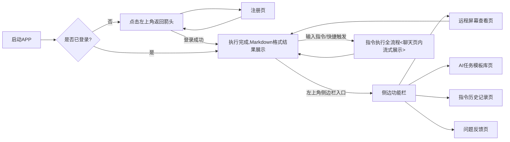

# 速控侠（Claw Chat）手机端开发方案
## 一、产品核心定位
速控侠手机端是速控侠三端协同架构的**核心操控入口**，专门面向OpenClaw用户打造，集设备远程操控、指令下发执行、实时状态监控、远程屏幕协同、AI任务模板管理、账号权限管控于一体的轻量化工具类APP。

它与PC端、服务端深度联动，通过标准化通信协议实现指令与数据的双向流转，用户在手机端即可完成对PC端OpenClaw核心程序的全场景操控，彻底解决OpenClaw移动端操作难、配置复杂的痛点。产品延续「零配置开箱即用、聊天式极简交互」的核心设计理念，无需手动配置IP、端口、穿透参数，登录同一账号即可自动完成组网对接，零基础用户1分钟内即可上手，全面覆盖个人远程操控、自动化任务执行、远程协助等多样化场景需求。

## 二、整体页面流转逻辑


## 三、核心页面功能与细节
### 3.1 登录页
#### 3.1.1 UI布局
- 页面顶部品牌区：齿轮样式品牌LOGO、「速控侠」主标题、「Claw Chat · 零配置远程操控」副标题；
- 核心输入模块：带用户图标的用户名输入框、带锁图标的密码输入框（支持密码可见/隐藏切换）；
- 隐私合规区：「我已阅读并同意《用户协议》《隐私政策》」勾选框（默认未勾选）；
- 主操作按钮：渐变蓝色「登录」按钮；
- 底部辅助入口：「还没有账号？立即注册」注册跳转入口、「忘记密码」找回入口。

#### 3.1.2 功能细节
- 输入校验：对用户名、密码进行非空校验、格式合规校验，实时提示格式错误原因；密码输入框下方新增密码强度弱提示（如“密码需包含字母与数字”）；
- 登录逻辑：校验通过后完成账号认证，同步获取用户权限、设备绑定信息，自动触发与服务端、PC端的地址协商与组网准备；登录成功后直接跳转至聊天主界面，同步在顶部展示临时组网状态提示；
- 安全机制：支持账号密码、短信验证码、生物识别（指纹/面容）等多种安全登录方式；异地登录、异常设备登录触发二次校验，登录日志同步至服务端账号体系；
- 跳转逻辑：点击「立即注册」跳转至注册页，点击「忘记密码」跳转至密码找回页，点击用户协议/隐私政策可查看对应详情。

### 3.2 注册页
#### 3.2.1 UI布局
- 左上角返回箭头按钮；
- 页面顶部标题：「注册账号」；
- 核心输入模块：用户名输入框、密码输入框、确认密码输入框；
- 主操作按钮：渐变蓝色「注册」按钮；
- 底部辅助入口：「已有账号？立即登录」登录跳转入口。

#### 3.2.2 功能细节
- 输入校验强化：
  - 用户名：新增唯一性实时校验，请求服务端校验用户名是否已被占用，实时反馈结果；
  - 密码：新增密码强度校验，要求包含大小写字母、数字和特殊字符，实时提示强度等级；
  - 确认密码：新增两次输入一致性校验，不一致时在输入框下方展示红色提示文字；
- 按钮状态联动：输入框未满足校验条件时，注册按钮设为半透明不可点击状态；所有校验项通过后，恢复渐变蓝色可点击状态；
- 注册逻辑：校验通过后完成账号注册，自动完成登录并跳转至聊天主界面，无需手动返回登录页；注册信息同步至服务端统一账号体系，与PC端账号权限打通；
- 返回逻辑：点击左上角返回箭头，直接回到登录页，保留登录页已输入的账号信息。

### 3.3 聊天主界面（核心主页）
#### 3.3.1 UI布局
- 顶部导航栏：左侧齿轮图标侧边栏入口、居中「速控侠」主标题、下方小型状态条（与侧边栏PC端状态同步）；
- 聊天主区域：气泡式聊天布局，用户发送消息为蓝色气泡居右，系统/PC端返回消息为白色气泡居左；
- 底部输入区：圆形蓝色「+」号快捷入口、「输入指令，发送给PC端执行」文本输入框、蓝色发送按钮。

#### 3.3.2 功能细节
1. **顶部导航栏**：
   - 左侧：齿轮图标，点击弹出侧边功能栏；
   - 中间：「速控侠」主标题，下方小型状态条正常状态展示绿色「已直连 XXms」，异常状态展示红色「未连接」；
   - 右侧：无额外入口，保持界面简洁。
2. **聊天主区域**：
   - **气泡样式与状态**：用户发送的蓝色气泡右侧新增执行状态标识（加载中=转圈动画、执行完成=对勾、执行失败=叉号）；PC端返回的白色气泡左侧新增状态图标（机器人图标=系统/PC反馈、感叹号=执行失败）；
   - **Markdown格式全量支持**：聊天气泡全面支持Markdown格式渲染，包括代码高亮、表格、列表、加粗/斜体、标题层级、Mermaid流程图，PC端返回的结构化执行结果可格式化清晰展示；
   - **流式输出与一键终止**：PC端通过WebSocket推送的Agent执行过程，可在聊天气泡中逐字实时展示，无需等待执行完成；执行中的指令气泡右侧新增红色「终止」按钮，点击后立即向PC端发送终止指令，中止当前OpenClaw Agent任务。
3. **底部输入区**：
   - 「+」号快捷入口：点击弹出「快捷指令」「模板调用」两个选项；
   - 文本输入框：支持多行输入、输入法自带语音输入，外接键盘场景下支持Ctrl+Enter快捷发送；新增快捷指令关键词联想匹配，输入模板编号自动联想对应指令；
   - 发送按钮：输入非空内容后可点击发送，将指令传输至PC端，驱动OpenClaw执行。
4. **核心交互逻辑**：
   - 用户发送指令后，优先通过端到端直连通道传输至PC端，直连异常时自动切换至服务端控制链路兜底转发；
   - 本地缓存近30天聊天记录，支持下拉刷新加载更早历史消息，与「指令历史记录页」数据双向同步；
   - 所有可点击按钮、消息气泡均提供点击反馈效果，符合安卓交互规范。

### 3.4 侧边功能栏
#### 3.4.1 UI布局
- 顶部品牌区：齿轮LOGO、「速控侠」标题、「Claw Control」副标题；
- 全链路状态区：「服务器状态」「PC端状态」「屏幕推送状态」「模板运行状态」四项，每项前带统一规范的状态圆点；
- 功能入口区：「查看远程屏幕」「AI任务模板库」「指令历史记录」「问题反馈」四个可点击入口，带对应图标；
- 底部操作区：「版本 1.0.0」版本信息、蓝色「退出登录」文字按钮。

#### 3.4.2 功能细节
1. **全链路状态可视化**：
   - 状态圆点规范：绿色=正常/已连接、红色=异常/已断开、黄色=执行中/组网中、灰色=关闭/未连接；
   - 状态文案同步核心参数：PC端状态同步展示网络延迟、屏幕推送状态同步展示当前清晰度、模板运行状态同步展示执行进度；
   - 异常状态自动刷新，同步展示重连倒计时与异常原因，无需用户手动刷新。
2. **功能入口**：
   - 所有功能入口点击后，侧边栏自动收起，跳转至对应页面，返回后侧边栏保持收起状态。
3. **底部操作区**：
   - 点击「退出登录」后，清除本地登录状态，跳转至登录页，同步通知服务端与PC端下线当前设备。
4. **交互与联动逻辑**：
   - 侧边栏支持点击外侧区域、点击手机返回键关闭，符合用户操作习惯；
   - 侧边栏状态与PC端、服务端毫秒级同步，打开侧边栏时自动刷新最新状态；
   - 状态异常时，同步通过Toast提示用户异常原因与解决方案。

### 3.5 远程屏幕查看页
#### 3.5.1 UI布局
- 顶部导航栏：左侧蓝色向左箭头返回按钮、居中「远程屏幕」标题、右侧清晰度切换与横竖屏切换两个蓝色图标按钮；
- 核心内容区：初始状态展示电脑图标、「远程屏幕查看」主标题、「实时展示PC端设备的屏幕画面 支持基础的远程控制操作」副标题、渐变蓝色「开始查看」按钮；查看状态全屏展示PC端屏幕画面；
- 底部操作悬浮窗：画面右下角半透明白色圆角悬浮窗，包含刷新、截图、全屏三个蓝色图标按钮；
- 状态悬浮窗：画面左上角半透明黑色悬浮窗，实时展示「清晰度 | 帧率 | 延迟」核心参数。

#### 3.5.2 功能细节
1. **核心画面区**：
   - 初始状态：完全保留现有UI布局与文案；
   - 查看状态：点击「开始查看」后，原有按钮与文案自动隐藏，全屏展示PC端屏幕画面，支持双指缩放、单击聚焦、长按调出操作菜单；
   - 加载状态：画面加载过程中展示「画面加载中...」占位符。
2. **操作与状态组件**：
   - 清晰度切换：支持标清/高清/超清三档切换，点击后实时向PC端发送参数调整指令，系统可根据网络带宽自动调整码率，避免卡顿；
   - 横竖屏切换：支持横竖屏自动切换，全屏模式下隐藏多余UI元素，最大化展示屏幕画面；
   - 底部操作悬浮窗：刷新、截图、全屏三个功能按钮，悬浮于画面右下角，不遮挡核心内容；
   - 状态悬浮窗：实时展示「清晰度 | 帧率 | 延迟」核心参数，与侧边栏状态同步。
3. **核心功能逻辑**：
   - 点击「开始查看」后，向PC端发送屏幕采集请求，通过WebRTC端到端直连通道接收PC端硬编码的H.265画面，低延迟渲染展示；
   - 远程控制：支持画面点击、滑动操作，模拟PC端鼠标点击、拖拽动作，指令通过直连通道低延迟传输；
   - 异常处理：画面断连时自动触发重连机制，展示「连接断开，正在重连...」提示，重连成功后自动恢复画面；点击返回按钮时，自动停止PC端屏幕采集，返回聊天主界面，同步更新侧边栏屏幕推送状态。

### 3.6 AI任务模板库页
#### 3.6.1 UI布局
- 顶部导航栏：左侧蓝色向左箭头返回按钮、居中「AI任务模板库」标题、右侧「新增+导入」蓝色按钮；
- 筛选区：白色圆角卡片，包含「全部、常用、系统预设、自定义」4个标签，选中标签为蓝色底色，其余为白色；
- 模板列表区：白色圆角卡片式布局，每张卡片包含左侧模板图标、中间模板名称+快捷编号+描述、右侧渐变蓝色「一键执行」按钮；
- 底部操作栏：「批量管理」「导出同步」蓝色文字按钮。

#### 3.6.2 功能细节
- 与PC端指令模板库实时云端同步，一端修改全端生效；
- 支持模板新增/编辑/删除、一键执行、批量导入导出、收藏置顶；
- 支持快捷编号触发，聊天框输入对应编号即可一键执行模板指令；
- 严格对齐版本计费规则，免费版最多支持10条模板存储，付费版无数量上限。

### 3.7 指令历史记录页
#### 3.7.1 UI布局
- 顶部导航栏：左侧蓝色向左箭头返回按钮、居中「指令历史」标题、右侧日期筛选+搜索图标；
- 历史列表区：白色圆角卡片式布局，按时间倒序排列，每张卡片包含指令内容、执行时间+状态+耗时、右侧「复用」「收藏」「删除」三个蓝色小图标；
- 空状态：无历史记录时，展示与远程屏幕页初始状态一致的图标+文案。

#### 3.7.2 功能细节
- 与PC端指令执行历史双向同步，全量记录手机端/PC端所有执行指令；
- 支持一键复用、一键收藏为模板、按关键词/日期/状态筛选、批量删除；
- 点击单条记录可展开查看完整指令原文、执行结果、执行日志、会话ID。

### 3.8 问题反馈页
#### 3.8.1 UI布局
- 顶部导航栏：左侧蓝色向左箭头返回按钮、居中「问题与建议」标题；
- 核心输入区：反馈类型选择下拉框、多行内容输入框、图片上传入口；
- 主操作按钮：渐变蓝色「提交反馈」按钮；
- 下方「历史反馈记录」板块：列表展示过往提交的反馈，包含反馈类型、提交时间、处理状态、官方回复内容。

#### 3.8.2 功能细节
- 支持反馈类型选择、图片/日志附件上传、提交进度实时展示；
- 官方回复后实时推送APP通知提醒，历史记录同步更新处理状态；
- 支持自动关联近期APP崩溃日志、异常事件，辅助问题定位。

## 四、核心功能模块设计
### 4.1 基础核心功能模块
1. **极简聊天式指令交互**
    借鉴微信聊天窗口交互逻辑，用户发送文字/语音指令即可完成对PC端OpenClaw的操控，无需学习专业指令；支持指令联想、快捷指令一键发送、历史指令复用，大幅降低用户学习成本与操作门槛。聊天窗口全面支持Markdown格式渲染，PC端返回的结构化执行结果可清晰格式化展示，提升信息可读性。

2. **零配置自动组网与链路管理**
    与PC端登录同一账号后，借助服务端完成地址协商与身份校验，自动发起网络穿透，建立端到端直连通道，全程无需手动配置任何网络参数；采用双链路冗余通信架构：
    - 控制链路：经服务端兜底传输，负责账号认证、状态同步、基础指令传输、重连调度，保障通信可靠性；
    - 数据链路：经端到端直连通道传输，负责屏幕画面、大体积文件、核心指令等数据传输，大幅降低延迟；
    全程采用端到端加密技术，保障信息传输安全。

3. **全链路状态可视化**
    与PC端、服务端毫秒级同步核心状态，通过统一配色的状态圆点直观展示服务端连接、PC端直连、屏幕推送、模板运行四大核心状态；异常状态实时推送Toast/弹窗提醒，同步展示异常原因与解决方案，无需专业知识即可快速排查问题。

4. **指令传输与执行闭环**
    手机端发送的指令，通过直连通道实时传输至PC端，PC端对接OpenClaw官方API执行后，执行结果、执行过程、状态数据通过WebSocket实时回传至手机端，在聊天窗口格式化展示，形成完整操作闭环，保障操作的及时性与有效性。支持指令流式输出、一键终止执行，提升操作可控性。

5. **断连自动重连与保活机制**
    针对移动端复杂多变的网络环境，采用规范的心跳保活机制，网络波动、切换网络、APP后台切回时，自动触发重连机制，重建与服务端、PC端的通信链路，全程无需人工干预，保障使用过程的连贯性。

6. **合规账号体系与安全管控**
    与产品总方案统一账号体系深度打通，支持账号密码、短信验证码、生物识别等多种安全登录方式；实现操作记录留存、登录设备管理、异地登录告警、账号安全防护等功能，为计费管理、权限分配、跨设备数据同步提供底层支撑。

### 4.2 高级核心功能模块
1. **远程屏幕实时协同**
    与PC端屏幕推送机制深度适配，PC端实时采集屏幕画面并硬编码，通过专属直连通道低延迟推送至手机端；支持标清/高清/超清三档清晰度切换、双指缩放、横竖屏自适应、远程触控操作，实现远程操作所见即所得，完美适配远程协助、实时监控等场景。

2. **AI任务模板快捷复用**
    与PC端指令模板库双向实时同步，支持将常用完整操作一键固化为可复用模板，自定义快捷编号与参数；后续在聊天框输入编号即可一键触发执行，无需重复输入长段指令；支持模板编辑、批量导入导出、跨设备同步、收藏置顶，大幅提升高频操作效率。

3. **全场景消息通知与告警**
    支持APP推送、站内消息两种通知方式，指令执行完成/失败、PC端离线、网络异常、官方反馈回复等场景，实时推送通知提醒用户；重要异常事件同步展示解决方案，实现问题早发现、早处理。

## 五、三端联动核心交互规则
1. **账号联动规则**：安卓端与PC端必须登录同一账号才可实现设备绑定与互联互通，单账号支持多设备管理，同一账号最多同时绑定1台PC端、3台移动端设备；账号权限、付费权益三端实时同步，一处付费全端生效。
2. **组网与连接规则**：双端登录后，自动通过服务端完成地址协商与身份校验，优先建立端到端直连通道；直连失败时，自动切换至服务端兜底中转链路，保障通信不中断；连接状态双端实时同步，异常时同步触发重连机制。
3. **指令执行规则**：手机端发送的指令（手动输入/模板调用/快捷触发），优先通过直连通道传输至PC端，直连异常时通过服务端控制链路兜底转发；PC端接收指令后，通过OpenClaw官方标准API驱动Agent执行，执行过程与结果通过WebSocket实时回传至手机端，流式展示在聊天窗口。
4. **数据同步规则**：AI任务模板、指令历史记录、用户配置、系统设置，通过服务端实现三端双向实时同步，一端修改，全端生效；同步过程支持断点续传，网络恢复后自动补全未同步数据。
5. **状态同步规则**：服务端连接状态、PC端在线状态、屏幕推送状态、模板执行状态，双端毫秒级同步；状态变更时，同步触发UI更新与用户提醒，确保用户实时掌握全链路运行情况。
6. **交互反馈规则**：所有可点击按钮/选项，点击后提供颜色变化、轻微动画等基础反馈；耗时操作（如指令发送、模板执行、远程屏幕连接）提供加载动画，避免用户重复操作；操作成功/失败提供明确的Toast提示，异常场景同步展示原因与解决方案。

## 六、技术选型与架构设计
### 6.1 核心开发架构与基础选型
1. **开发语言**：Kotlin 2.3.10，谷歌官方首选安卓开发语言，语法简洁、空安全，原生支持协程与Flow，与Jetpack Compose声明式开发完美适配，提高开发效率与代码稳定性。
2. **架构模式**：MVVM分层架构（Model - View - ViewModel），实现UI、业务逻辑、数据层的完全解耦，增强代码可维护性与可测试性，契合Jetpack Compose状态驱动UI的核心特性。
3. **核心UI框架**：Jetpack Compose，全页面采用声明式UI实现，替代传统安卓View体系，代码简洁、UI渲染高效、动画流畅，大幅降低多机型、多尺寸屏幕的适配成本，保证不同安卓设备体验一致。
4. **编译环境**：
   - Android Gradle Plugin (AGP)：8.13.2
   - Android Studio Iguana及以上版本
   - minSdkVersion 21（覆盖安卓5.0及以上99.8%的活跃设备）
   - targetSdkVersion 34（适配安卓14最新系统规范）

### 6.2 核心依赖库版本
```toml
[versions]
agp = "8.13.2"
kotlin = "2.3.10"

# AndroidX 核心库
coreKtx = "1.17.0"
lifecycleRuntimeKtx = "2.10.0"
activityCompose = "1.12.4"
navigationCompose = "2.9.7"

# Compose 相关
composeBom = "2026.02.00"
material3 = "1.4.0"
foundationLayout = "1.10.3"
foundation = "1.10.3"
```

### 6.3 分层架构设计
#### 1. UI层（View层）
- 核心实现：通过Jetpack Compose的Composable函数实现所有页面，遵循Material3 1.4.0设计规范，保证界面风格统一、交互流畅；
- 页面导航：Navigation Compose 2.9.7统一管理APP页面跳转逻辑，规范各页面路由地址，实现页面间参数传递与返回栈管理，与Compose深度融合；
- 状态管理：运用Compose内置的remember + mutableStateOf管理页面局部状态，结合StateFlow管理ViewModel中的全局可观察状态，数据变化自动触发UI重组，实时更新聊天消息、设备状态、执行进度等；
- 核心组件实现：侧边栏抽屉布局、聊天气泡列表、Markdown渲染组件、远程屏幕画面渲染、模板卡片等核心交互，通过Compose原生组件与修饰符实现，无需自定义View，简化代码结构。

#### 2. ViewModel层
- 核心组件：Jetpack ViewModel，生命周期感知型组件，管理页面业务逻辑与状态数据，不受屏幕旋转等配置变更影响，防止数据丢失；
- 异步处理：Kotlin协程 + Flow/StateFlow，处理网络请求、WebSocket长连接、实时状态监听、消息收发等后台任务，主线程安全，避免内存泄漏，与Compose状态系统深度适配；
- 职责边界：仅处理业务逻辑，不持有UI上下文引用，通过StateFlow向UI层暴露可观察状态，通过公共方法接收UI层的用户操作事件，实现UI与业务逻辑的完全解耦。

#### 3. Model层（数据层）
- 仓库层（Repository）：统一数据入口，隔离本地与远程数据源，为ViewModel层提供统一的数据调用接口，屏蔽数据来源差异，实现数据的统一管理与复用；
- 本地数据存储：
  - Jetpack Room：SQLite的ORM封装，轻量高效、类型安全，用于存储聊天消息缓存、指令历史记录、AI任务模板、用户基础信息、系统配置；
  - Jetpack DataStore：基于Kotlin协程与Flow的轻量级键值对存储，替代SharedPreferences，用于存储用户登录状态、本地配置项、权限标识等小体量数据，主线程安全、支持事务；
- 远程数据源：负责与服务端、PC端的通信交互，包括RESTful接口请求、WebSocket长连接管理、WebRTC音视频传输，为仓库层提供远程数据与通信能力。

### 6.4 核心功能配套技术实现
#### 1. 网络与实时通信技术
- 基础接口请求：Retrofit2 + OkHttp3，实现登录注册、问题反馈、模板同步、账号管理等RESTful接口请求，原生支持Kotlin挂起函数与Flow，配合协程实现异步网络调用；支持请求拦截、统一异常处理、HTTPS加密传输、请求头统一管理。
- 实时消息与状态同步：WebSocket + Kotlin Flow，实现与服务端、PC端的长连接管理，完成聊天消息实时收发、设备状态实时推送、指令执行过程流式传输；支持断线自动重连、心跳保活、消息ack确认机制，保障消息不丢失、不重复。
- 远程屏幕传输：WebRTC实时传输协议 + H.265硬解码，实现PC端屏幕画面的低延迟、高流畅度实时投屏；配合Compose的TextureView可组合组件实现高效画面渲染，支持硬件加速，降低CPU占用，中低端设备也能流畅运行。
- Markdown渲染：采用Markwon核心库，配合Mermaid、代码高亮、表格扩展插件，封装为Compose可组合组件，嵌入聊天气泡布局，支持全量Markdown语法与流程图渲染，自定义样式匹配产品主题。

#### 2. 广告与变现技术适配
- 集成字节跳动穿山甲广告联盟SDK，实现开屏广告、信息流Banner广告、激励视频广告、插屏广告的全量适配；严格遵循平台规范，实现广告的预加载、展示、点击、收益回调全流程管理。
- 与账号体系深度打通，付费版用户登录后，自动屏蔽所有广告请求、销毁广告实例，全程无广告展示；免费版用户按预设的场景与频次规则展示广告，不干扰核心功能使用。

#### 3. 安全与权限适配
- 权限管理：Accompanist Permissions，适配安卓动态权限申请规范，简化权限申请与状态监听逻辑，与Compose UI深度融合；严格遵循最小必要原则，仅申请核心功能必需的权限，用户明示同意后才会调用对应权限。
- 数据安全：AES-256对称加密本地敏感数据存储，RSA非对称加密网络请求与端到端数据传输，保障用户账号、指令、画面数据的安全；不采集与核心功能无关的用户隐私数据，严格遵循国家隐私合规规范。
- 防篡改机制：付费版权益、权限配置通过服务端统一校验，本地无法篡改；APP安装包进行签名加固，防止二次打包与恶意篡改。

#### 4. 配套工具与运维
- 图片加载：Coil，Kotlin-first图片加载库，与Jetpack Compose深度适配，一行代码实现图片加载、缓存、变换，内存占用低、性能优秀。
- 崩溃与异常监控：腾讯Bugly，收集分析线上APP崩溃日志、ANR、异常问题，支撑版本迭代与问题修复。
- 代码规范：严格遵循Kotlin官方编码规范，结合Android Lint与Compose Lint保障代码质量与可维护性。

## 七、版本与计费适配
### 7.1 免费版功能权限
- 可使用全部基础核心功能，包括聊天式指令交互、自动组网、全链路状态展示、基础指令执行、断连自动重连；
- 支持基础标清屏幕推送，每日屏幕推送时长上限2小时；
- 最多支持10条AI任务模板存储与基础调用权限；
- 每日指令执行次数上限50次，超出后需等待次日重置，或观看激励视频解锁临时额度；
- 展示非侵入式合规广告，包括开屏广告、聊天列表底部Banner广告，非核心场景低频插屏广告；
- 不支持模板批量导入导出、自定义参数模板、高清屏幕推送等高级功能。

### 7.2 付费版功能权限
- 解锁全部高级核心功能，享受无广告、无使用时长/流量/次数限制的纯净服务；
- 支持高清/超清屏幕推送、优先通信通道、无上限AI任务模板存储；
- 解锁模板批量导入导出、自定义参数模板、多设备同时连接、指令历史无限期保留等全量高级权限；
- 享受专属客服支持、问题优先处理、版本优先更新权益；
- 采用纯按量计费模式，用多少算多少，无隐形消费、无最低消费、无强制包月扣费，一键开通即可生效。

### 7.3 权限管控机制
- 所有版本权限均通过服务端统一校验，用户登录后实时下发权限标识，APP端根据权限标识动态控制功能入口与使用限制；
- 付费权益到期后，自动降级为免费版权限，提前3天向用户推送权益到期提醒，引导用户续费；
- 免费版用户可通过观看激励视频，临时解锁当日使用时长、指令次数、模板数量上限，或临时体验高清屏幕推送等付费功能。

## 八、抖音系广告平台对接落地
### 8.1 对接平台选型
采用字节跳动官方**穿山甲广告联盟**，作为抖音系唯一官方广告变现平台，整合抖音、抖音极速版、今日头条等字节全系流量资源，广告填充率高、eCPM收益稳定，合规性强，完美适配本产品安卓APP变现需求。

### 8.2 广告位场景与频次设计
严格遵循「非侵入式、不干扰核心功能、不影响用户体验」的核心原则，仅在免费版设置广告位，付费版全程无广告，具体设计如下：

| 广告类型 | 展示场景 | 触发规则 | 展示位置 | 频次管控 |
|----------|----------|----------|----------|----------|
| 开屏广告 | APP冷启动场景 | 用户首次打开APP、APP后台切回前台超过5分钟时触发 | 安卓APP全屏开屏页，展示时长不超过5秒，支持用户手动跳过 | 单日单用户展示不超过3次，冷启动高频打开不重复展示 |
| 信息流Banner广告 | 聊天列表主页面 | 用户进入APP主界面常驻展示，不随聊天列表滚动 | 聊天列表页面底部，输入框下方，不遮挡核心聊天内容、指令输入框与功能按钮 | 常驻展示，每30秒自动轮播刷新，无强制点击要求 |
| 激励视频广告 | 权益解锁场景 | 用户主动点击触发，非强制展示 | 独立全屏视频页面，播放完成后自动关闭 | 无频次上限，由用户主动触发，用于解锁免费版时长上限、额外指令模板、高清屏幕推送等临时权益 |
| 插屏广告 | 非核心操作结束场景 | 用户完成单次指令执行、模板保存等非核心操作后，低频触发 | APP半屏弹窗，支持一键关闭 | 单日单用户展示不超过2次，核心操作路径（指令发送、屏幕查看）全程不触发 |

### 8.3 技术实现方案
1. **SDK集成**：在安卓项目Gradle文件中添加穿山甲SDK依赖，配置混淆规则，适配安卓13及以上版本的权限要求；仅申请网络、设备信息等必要权限，不强制申请非必要权限。
2. **SDK初始化**：在APP启动页中，完成用户隐私政策授权后，异步初始化穿山甲SDK，传入接入密钥与用户唯一标识；不提前初始化，避免影响APP启动速度；付费版用户全程不初始化SDK，不发起任何广告请求。
3. **广告位逻辑开发**：
    - 开屏广告：在APP启动页加载广告，设置跳过按钮与超时关闭逻辑，广告展示完成/跳过后自动进入APP主界面；
    - Banner广告：在聊天列表页底部嵌入Banner广告组件，绑定页面生命周期，页面销毁时自动释放广告资源；
    - 激励视频广告：提前预加载广告资源，用户点击解锁权益时拉起视频广告，监听播放完成回调，播放完成后通过服务端为用户发放对应临时权益；
    - 插屏广告：按频次管控规则预加载，在指定非核心场景触发展示，设置强制关闭按钮，不强制用户观看/点击。
4. **资源释放**：所有广告组件均绑定页面生命周期，页面退出、APP退到后台时自动销毁广告实例，避免内存泄漏。
5. **数据回调**：对接穿山甲广告服务端回调接口，获取用户广告展示、点击、播放完成、收益等明细数据，同步到产品服务端，实现变现数据的实时统计与分析。

### 8.4 合规管控体系
1. 隐私合规管控：严格遵循穿山甲平台隐私规范与国家法律法规，仅在用户同意隐私政策、完成授权后初始化广告SDK；不超范围采集用户数据，支持用户关闭广告个性化推荐。
2. 广告内容审核：开启穿山甲平台广告内容过滤功能，屏蔽违规、低俗、虚假宣传、竞品相关广告，设置行业过滤规则，确保广告内容符合应用商店上架要求与产品定位。
3. 用户权益保障：所有广告均设置明确的关闭/跳过按钮，不设置虚假关闭按钮、不强制用户点击/观看广告，不诱导用户下载应用，不中断核心功能使用。
4. 反作弊管控：对接穿山甲反作弊接口，拦截刷量、虚假点击等作弊行为，确保广告数据真实有效，规避账号封禁风险。

## 九、安全与合规适配
1. 权限合规：严格遵循安卓权限管理规范，遵循最小必要原则，仅申请核心功能必需的权限，不申请与功能无关的权限；所有权限均在用户使用对应功能时主动申请，明示权限用途，用户拒绝后不影响其他功能使用。
2. 隐私合规：严格遵循《个人信息保护法》《网络安全法》等相关法规，制定清晰的用户协议与隐私政策，明确告知用户数据采集范围、用途、存储期限；仅采集必要的用户信息，不强制获取非必要隐私数据，支持用户查询、删除、注销账号。
3. 数据安全：本地敏感数据采用AES-256加密存储，网络传输采用HTTPS、端到端加密技术，防止数据泄露、篡改；用户注销账号后，按法规要求清除对应的用户数据，保障用户数据权益。
4. 应用商店适配：严格遵循国内主流安卓应用商店（华为、小米、OPPO、vivo、应用宝）的上架规范，完成APP备案、软件著作权登记，适配各厂商的权限、隐私、广告规范，保障APP顺利上架与更新。
5. 安全加固：对APK安装包进行代码混淆、加壳加固，防止反编译、二次打包、恶意篡改；集成安全校验机制，检测运行环境风险，保障APP运行安全。