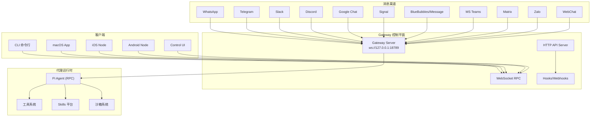
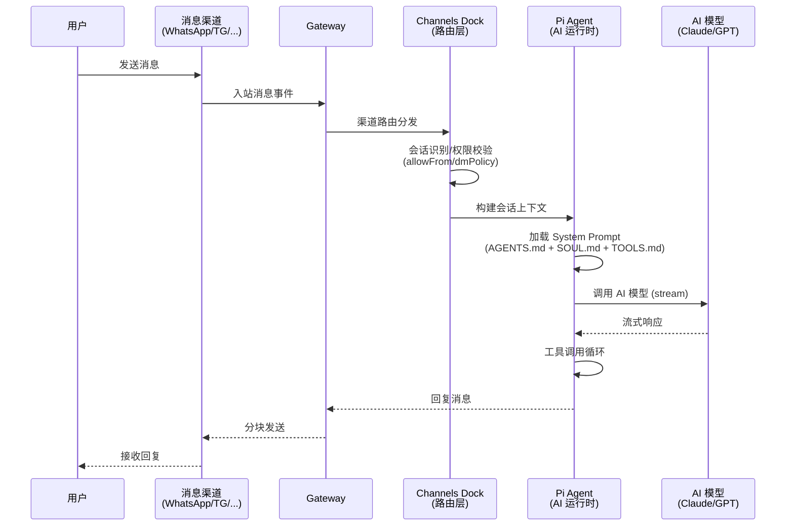
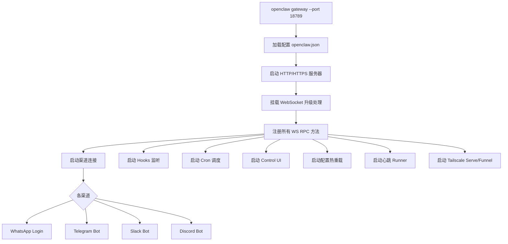
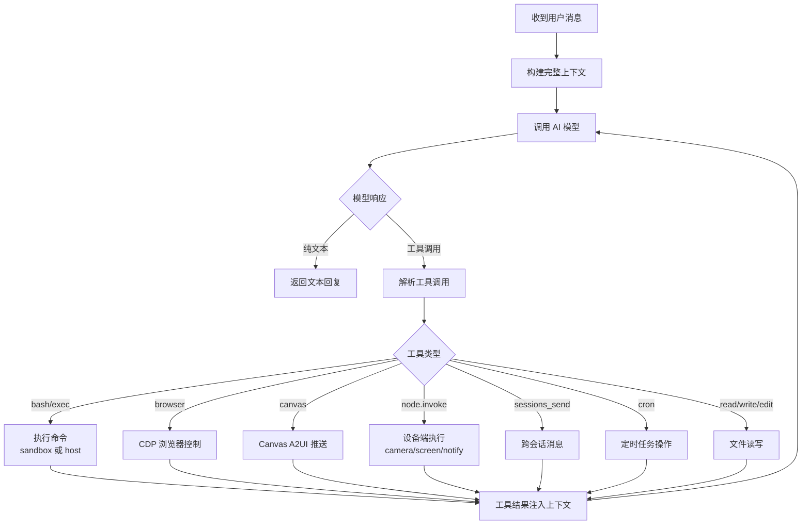

# OpenClaw 代码架构分析

## 项目概览

OpenClaw 是一个**个人 AI 助手平台**，采用 TypeScript monorepo 架构。核心思想是：**Gateway 作为唯一控制平面**，所有客户端（CLI、macOS App、iOS/Android Node、WebChat、各消息渠道）通过 WebSocket 连接到 Gateway 进行通信。



---

## 代码目录结构

| 目录 | 功能描述 |
|------|----------|
| `src/gateway/` | **核心：Gateway 服务器**，包含 HTTP/WebSocket 服务、认证、会话管理、协议处理 |
| `src/agents/` | **AI 代理运行时**（Pi Agent），模型调用、工具执行、系统提示词、沙箱、Skills |
| `src/channels/` | **消息渠道适配层**，统一消息路由、会话识别、自动回复控制 |
| `src/whatsapp/` | WhatsApp 渠道（Baileys） |
| `src/telegram/` | Telegram 渠道（grammY） |
| `src/slack/` | Slack 渠道（Bolt） |
| `src/discord/` | Discord 渠道（discord.js） |
| `src/signal/` | Signal 渠道（signal-cli） |
| `src/imessage/` | iMessage 渠道 |
| `src/config/` | 配置管理（`openclaw.json`） |
| `src/web/` | Control UI 和 WebChat Web 界面 |
| `src/canvas-host/` | Canvas/A2UI 可视化工作区 |
| `src/media/` | 媒体管道（图片/音频/视频处理） |
| `src/cron/` | 定时任务系统 |
| `src/sessions/` | 会话模型与状态管理 |
| `src/security/` | 安全模块（密钥管理、速率限制） |
| `src/providers/` | AI 模型提供商适配（Anthropic/OpenAI/Google 等） |
| `src/tts/` | TTS 语音合成 |
| `src/browser/` | 浏览器控制工具（CDP） |
| `src/cli/` | CLI 入口与命令 |
| `src/wizard/` | 引导安装向导 |
| `src/plugins/` | 插件系统 |
| `src/hooks/` | Hook 生命周期 |
| `src/pairing/` | 设备配对 |
| `src/node-host/` | Node 设备管理 |
| `src/routing/` | 消息路由引擎 |
| `src/memory/` | 记忆/上下文管理 |
| `ui/` | 前端 UI 构建产出 |
| `extensions/` | 扩展渠道插件（MS Teams/Matrix/Zalo 等） |
| `packages/` | 子包（clawdbot/moltbot） |
| `apps/` | 伴侣应用（macOS/iOS/Android） |

---

## 核心执行流程

### 1. 消息处理主流程



### 2. Gateway 启动流程



### 3. Agent 工具调用循环



---

## API 接口分类

### 一、WebSocket RPC 方法（`ws://127.0.0.1:18789`）

所有客户端通过 WebSocket 连接后，使用 JSON-RPC 风格的消息与 Gateway 通信。

#### 健康与状态

| 方法 | 说明 |
|------|------|
| `health` | 健康检查 |
| `status` | 获取 Gateway 状态 |
| `doctor.memory.status` | 内存诊断 |
| `last-heartbeat` | 最近心跳时间 |
| `set-heartbeats` | 设置心跳间隔 |
| `wake` | 唤醒 Gateway |

#### 会话管理

| 方法 | 说明 |
|------|------|
| `sessions.list` | 列出所有会话 |
| `sessions.preview` | 预览会话内容 |
| `sessions.patch` | 修改会话参数（model/thinking/verbose 等） |
| `sessions.reset` | 重置会话 |
| `sessions.delete` | 删除会话 |
| `sessions.compact` | 压缩会话上下文 |

#### 聊天 / Agent 控制

| 方法 | 说明 |
|------|------|
| `agent` | 发送消息给 Agent |
| `agent.identity.get` | 获取 Agent 身份信息 |
| `agent.wait` | 等待 Agent 完成 |
| `chat.send` | WebChat 发送消息 |
| `chat.history` | WebChat 获取历史 |
| `chat.abort` | 中断正在进行的回复 |
| `send` | 通过渠道发送消息 |

#### 渠道管理

| 方法 | 说明 |
|------|------|
| `channels.status` | 各渠道连接状态 |
| `channels.logout` | 登出渠道 |

#### 配置管理

| 方法 | 说明 |
|------|------|
| `config.get` | 获取配置 |
| `config.set` | 设置配置项 |
| `config.apply` | 应用完整配置（限流：3次/60s） |
| `config.patch` | 增量修改配置（限流：3次/60s） |
| `config.schema` | 获取配置 Schema |

#### 模型管理

| 方法 | 说明 |
|------|------|
| `models.list` | 列出可用模型 |

#### TTS 语音

| 方法 | 说明 |
|------|------|
| `tts.status` | TTS 状态 |
| `tts.providers` | 可用 TTS 提供商 |
| `tts.enable` / `tts.disable` | 启用/禁用 TTS |
| `tts.convert` | 文本转语音 |
| `tts.setProvider` | 设置 TTS 提供商 |

#### Voice Wake & Talk Mode

| 方法 | 说明 |
|------|------|
| `voicewake.get` / `voicewake.set` | 语音唤醒配置 |
| `talk.config` | Talk Mode 配置 |
| `talk.mode` | Talk Mode 状态切换 |

#### Cron 定时任务

| 方法 | 说明 |
|------|------|
| `cron.list` | 列出定时任务 |
| `cron.status` | 定时任务状态 |
| `cron.add` | 添加定时任务 |
| `cron.update` | 更新定时任务 |
| `cron.remove` | 删除定时任务 |
| `cron.run` | 手动触发定时任务 |
| `cron.runs` | 查看运行历史 |

#### Node 设备管理

| 方法 | 说明 |
|------|------|
| `node.list` | 列出已连接 Node |
| `node.describe` | 获取 Node 能力与权限 |
| `node.invoke` | 调用 Node 命令（camera/screen/notify/system.run） |
| `node.invoke.result` | 获取调用结果 |
| `node.event` | Node 事件 |
| `node.rename` | 重命名 Node |
| `node.pair.request` / `node.pair.list` / `node.pair.approve` / `node.pair.reject` / `node.pair.verify` | Node 配对管理 |

#### Device 配对

| 方法 | 说明 |
|------|------|
| `device.pair.list` / `device.pair.approve` / `device.pair.reject` / `device.pair.remove` | 设备配对管理 |
| `device.token.rotate` / `device.token.revoke` | 设备 Token 管理 |

#### 执行审批

| 方法 | 说明 |
|------|------|
| `exec.approvals.get` / `exec.approvals.set` | 审批策略管理 |
| `exec.approvals.node.get` / `exec.approvals.node.set` | Node 审批策略 |
| `exec.approval.request` | 请求审批 |
| `exec.approval.waitDecision` | 等待审批结果 |
| `exec.approval.resolve` | 解决审批请求 |

#### Skills 管理

| 方法 | 说明 |
|------|------|
| `skills.status` | Skills 状态 |
| `skills.bins` | Skills 二进制列表 |
| `skills.install` | 安装 Skill |
| `skills.update` | 更新 Skill |

#### Agents 管理（多 Agent）

| 方法 | 说明 |
|------|------|
| `agents.list` | 列出所有 Agent |
| `agents.create` | 创建 Agent |
| `agents.update` | 更新 Agent |
| `agents.delete` | 删除 Agent |
| `agents.files.list` / `agents.files.get` / `agents.files.set` | Agent 文件管理 |

#### 浏览器控制

| 方法 | 说明 |
|------|------|
| `browser.request` | 浏览器操作请求（CDP 快照/操作） |

#### 向导

| 方法 | 说明 |
|------|------|
| `wizard.start` / `wizard.next` / `wizard.cancel` / `wizard.status` | 引导安装向导 |

#### 日志与使用量

| 方法 | 说明 |
|------|------|
| `logs.tail` | 实时日志 |
| `usage.status` | 使用量统计 |
| `usage.cost` | 费用统计 |

#### 系统与更新

| 方法 | 说明 |
|------|------|
| `system-presence` | 系统在线状态 |
| `system-event` | 系统事件 |
| `update.run` | 执行更新（限流：3次/60s） |
| `tools.catalog` | 工具目录列表 |

---

### 二、WebSocket 事件（Gateway → 客户端推送）

| 事件名 | 说明 |
|--------|------|
| `connect.challenge` | 连接认证质询 |
| `agent` | Agent 输出事件（流式文本/工具结果） |
| `chat` | WebChat 聊天事件 |
| `presence` | 在线/打字状态 |
| `tick` | 心跳 tick |
| `talk.mode` | Talk Mode 状态变化 |
| `shutdown` | Gateway 关闭通知 |
| `health` | 健康状态事件 |
| `heartbeat` | 心跳事件 |
| `cron` | Cron 任务执行事件 |
| `node.pair.requested` / `node.pair.resolved` | Node 配对事件 |
| `node.invoke.request` | Node 调用请求事件 |
| `device.pair.requested` / `device.pair.resolved` | 设备配对事件 |
| `voicewake.changed` | 语音唤醒配置变化 |
| `exec.approval.requested` / `exec.approval.resolved` | 执行审批事件 |
| `update-available` | 更新可用通知 |

---

### 三、HTTP REST API 端点

Gateway HTTP 服务器处理优先级（按顺序匹配）：

| 优先级 | 路径/功能 | 说明 |
|--------|-----------|------|
| 1 | `POST {basePath}/wake` | **Webhook 唤醒**：发送唤醒命令 |
| 2 | `POST {basePath}/agent` | **Webhook 触发 Agent**：发送消息触发 Agent 执行 |
| 3 | `POST {basePath}/*` | **Webhook 映射**：自定义 Hook 映射规则 |
| 4 | `POST /api/tools/invoke` | **工具远程调用**：HTTP 端点直接调用工具 |
| 5 | `POST /api/channels/slack/*` | **Slack HTTP 事件**：Slack Bolt 交互端点 |
| 6 | `/api/channels/*` | **渠道插件 HTTP 端点**（需 Gateway 认证） |
| 7 | `POST /v1/responses` | **OpenResponses API**：兼容 OpenResponses 规范 |
| 8 | `POST /v1/chat/completions` | **OpenAI 兼容 API**：chat completions 端点 |
| 9 | `/canvas/*` `/a2ui/*` | **Canvas/A2UI**：可视化工作区 HTTP 服务 |
| 10 | `GET /avatar/*` | **Agent 头像**：获取 Agent 头像图片 |
| 11 | `GET /*` | **Control UI**：Web 管理界面（SPA） |

#### Hooks API 详情

> 认证方式：`Authorization: Bearer <token>` 或 `X-OpenClaw-Token` Header

```
POST {hooks.basePath}/wake
Body: { text: string, mode?: "now" | "next-heartbeat" }
→ 唤醒 Gateway

POST {hooks.basePath}/agent
Body: { message: string, name?: string, agentId?: string, sessionKey?: string, deliver?: {...} }
→ 触发 Agent 执行，返回 { ok: true, runId: string }
```

#### OpenAI Chat Completions 兼容 API

> 认证方式：`Authorization: Bearer <token>`

```
POST /v1/chat/completions
Body: {
  model?: string,
  messages: [{ role: "system"|"user"|"assistant", content: string }],
  stream?: boolean,
  user?: string
}
→ 兼容 OpenAI Chat API 格式，支持流式/非流式
```

#### OpenResponses API

> 认证方式：`Authorization: Bearer <token>`
> 规范：https://www.open-responses.com/

```
POST /v1/responses
Body: {
  model?: string,
  input: string | [{ role, content }],
  stream?: boolean,
  tools?: [...],
  tool_choice?: "auto"|"none"|"required"|{type,name},
  ...
}
→ 兼容 OpenResponses 规范，支持流式/非流式、工具调用
```

---

### 四、认证与安全

| 层级 | 机制 |
|------|------|
| WebSocket 连接 | 连接时发送 `connect` 方法携带 token/password 认证 |
| HTTP 端点 | Bearer Token、密码认证、Tailscale 身份 Header |
| 本地请求 | Loopback 地址直接访问免认证 |
| Hooks | 独立 Token 认证 + 速率限制（20次/60s 失败锁定） |
| DM 策略 | `pairing`（默认，需配对码验证）/ `open`（公开接受） |
| 角色模型 | `operator`（默认） / `node` / `admin` |
| 速率限制 | 控制面写操作限流 3次/60s（config.apply/config.patch/update.run）|
| 沙箱 | Docker 沙箱隔离非主会话的工具执行 |

---

### 五、配置入口

主配置文件：`~/.openclaw/openclaw.json`

```jsonc
{
  "agent": { "model": "anthropic/claude-opus-4-6" },
  "channels": {
    "whatsapp": { "allowFrom": [...] },
    "telegram": { "botToken": "..." },
    "slack": { "botToken": "...", "appToken": "..." },
    "discord": { "token": "..." }
  },
  "gateway": {
    "port": 18789,
    "bind": "loopback",
    "auth": { "mode": "token"|"password" },
    "tailscale": { "mode": "off"|"serve"|"funnel" }
  },
  "hooks": { "token": "...", "basePath": "/hooks" },
  "browser": { "enabled": true },
  "agents": { "defaults": { "workspace": "~/.openclaw/workspace" } }
}
```

---

## 总结

OpenClaw 是一个**架构精良的个人 AI 助手网关系统**，核心设计特点：

1. **单一控制平面**：Gateway 作为唯一入口，统一管理所有客户端和渠道
2. **WebSocket RPC 协议**：90+ 个 RPC 方法覆盖完整的控制面需求
3. **多渠道统一接入**：14+ 消息渠道通过适配层统一接入
4. **兼容性 HTTP API**：OpenAI Chat Completions + OpenResponses 双规范兼容
5. **安全分层**：角色/Scope/速率限制/配对验证/沙箱隔离多层防护
6. **可扩展**：插件系统 + Skills 平台 + 扩展渠道机制
